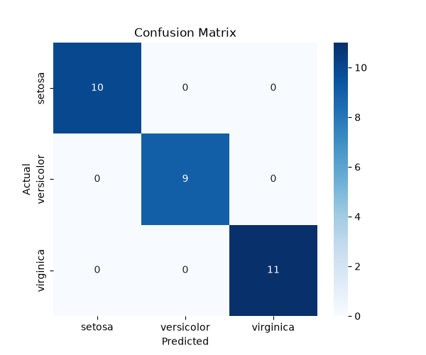
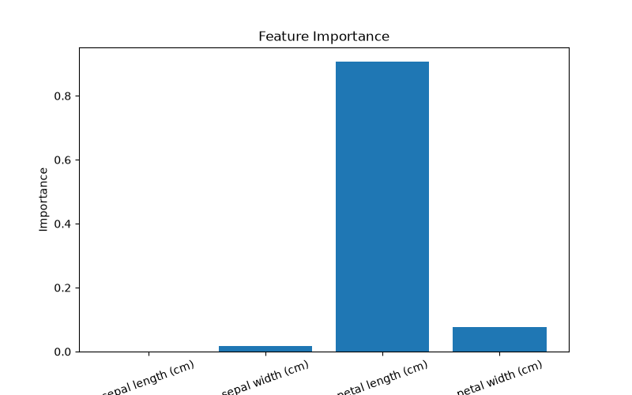

# Iris Flower Classification using Decision Tree

## Project Overview
This project is a Machine Learning classification project that uses the Iris flower dataset to classify flowers into three species using a Decision Tree Classifier.

The model predicts whether a flower belongs to:
- Setosa
- Versicolor
- Virginica

---

## Objective
The objective of this project is to:
- Understand and explore the Iris dataset.
- Train a machine learning classification model.
- Evaluate the model's performance using different metrics.
- Visualize the results using graphs.

---

## Technologies Used
- Python
- Scikit-learn
- NumPy
- Matplotlib
- Seaborn

---

## Dataset
This project uses the Iris dataset provided by Scikit-learn.

### Features
- Sepal Length (cm)
- Sepal Width (cm)
- Petal Length (cm)
- Petal Width (cm)

### Target Classes
- Setosa
- Versicolor
- Virginica

---

## Machine Learning Algorithm
The project uses a **Decision Tree Classifier** for classification.

Decision Trees are simple, easy to interpret, and perform well on classification problems.

---

## Project Workflow

1. Load the Iris dataset.
2. Split the dataset into training and testing sets.
3. Train the Decision Tree model.
4. Make predictions on test data.
5. Evaluate the model using:
   - Accuracy Score
   - Classification Report
   - Confusion Matrix
6. Visualize the results.

---

## Model Performance

### Accuracy
```
100.00%
```

### Classification Report
The model achieved perfect scores for:
- Precision
- Recall
- F1-Score

for all three classes.

---

## Visualizations

### Confusion Matrix
The confusion matrix shows the comparison between actual and predicted values.



### Feature Importance
The feature importance graph shows which features contributed the most to the model's predictions.

The model identified **Petal Length** as the most important feature.



---

## Project Structure

```text
AI_project_2/
│
├── main.py
├── README.md
├── requirements.txt
├── confusion_matrix.png
├── feature_importance.png
├── screenshots/
└── venv/
```

---

## Installation

Clone the repository:

```bash
git clone <repository-url>
```

Move into the project directory:

```bash
cd AI_project_2
```

Create a virtual environment:

```bash
python -m venv venv
```

Activate the virtual environment:

### Windows
```bash
venv\Scripts\activate
```

Install dependencies:

```bash
pip install -r requirements.txt
```

---

## Running the Project

```bash
python main.py
```

---

## Results
- Model Accuracy: **100%**
- All test samples classified correctly.
- Confusion Matrix generated successfully.
- Feature Importance visualization generated successfully.

---

## Future Improvements
- Compare multiple machine learning algorithms such as:
  - Random Forest
  - Support Vector Machine (SVM)
  - K-Nearest Neighbors (KNN)
- Deploy the model as a web application.
- Use larger datasets for experimentation.

---

## Author
**Rithika Sankar**

Internship Project - Machine Learning using Python
